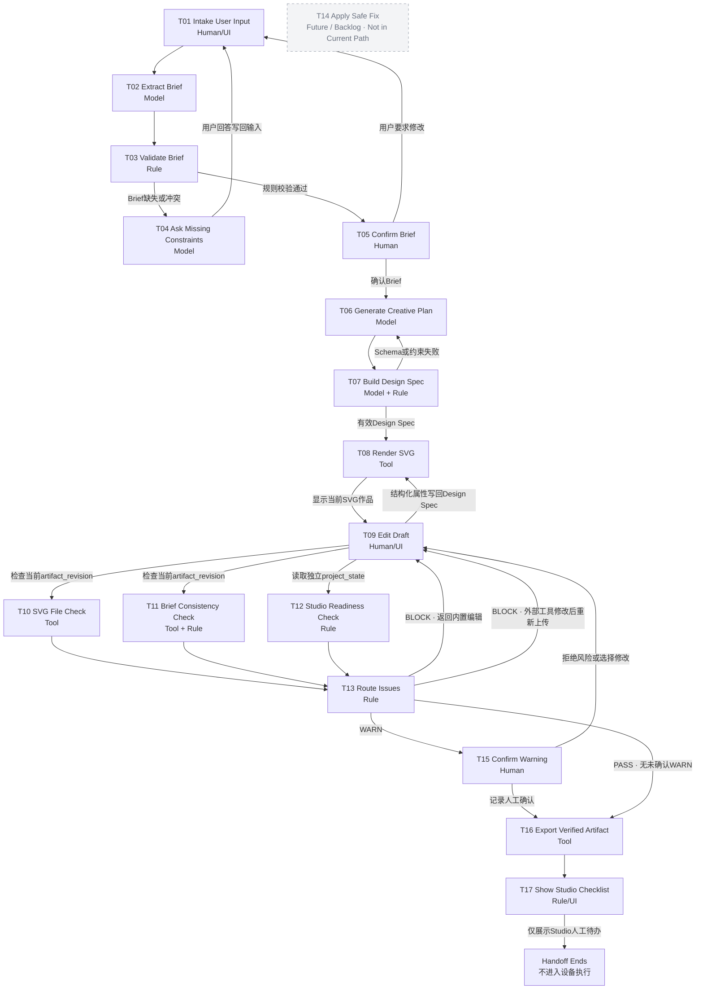

# MakerFlow Agent Task Graph v1.0

> 阶段：W2-D05 Agent架构定义  
> 产品范围：MakerFlow v2.0低保真流程，单一场景为“MomoRay模块化枕头包装内高度调节说明卡”  
> 不包含：API接入、正式业务代码、Skill Registry、Skill Contract、PRD、xTool原生集成或设备控制

## 1. 架构目标与边界

本Task Graph把MakerFlow主任务拆成输入、语义理解、规则门、人工确认、SVG生成、确定性Preflight、问题恢复和交接。它不是七个页面的导航图，而是带有输入输出、依赖、失败模式、副作用和恢复路径的执行图。

核心链路：

```text
Creative Brief
→ Creative Plan
→ Build Design Spec
→ SVG Renderer
→ 浏览器显示当前SVG作品
→ 用户通过结构化控件修改Design Spec
→ SVG实时重渲染
→ 对当前`artifact_revision`执行MakerFlow Preflight
→ Resolve Issues
→ Export & Handoff
```

产品边界：

- Design Spec是MakerFlow内部single source of truth，不是要求用户直接编辑JSON的界面；
- External SVG路径以外部Artifact为authoring source of truth，仅生成可靠可解析部分的derived partial spec；External SVG不进入T08 Renderer；
- Artifact Manager属于Orchestrator / Project State Infrastructure，不是Skill，也不新增Task；它在Renderer返回后负责Artifact persistence、`artifact_revision`、`source_design_spec_revision`和Preflight invalidation；
- SVG从一开始就是主作品、浏览器中的可视化设计稿和主要交付文件；
- PNG/JPG只作为素材或参考，不是核心中间格式；
- 不存在“图片生成→图片转SVG→Preflight”链路；
- 不调用模型API、AImake API或xTool Studio；
- Brief、Design Spec、Preflight报告和确认记录是用户项目记录，不声称由Studio读取；
- T17只显示Studio人工待办，流程不进入机器执行；
- xTool Studio导入、Preview和Framing等具体行为均为`[待实际验证]`；
- PASS只代表通过MakerFlow当前规则，不保证加工成功。

## 2. Graph



独立Mermaid源文件见`06_agent_task_graph.mmd`；紧凑I/O总表见`06_node_io_matrix.md`。

## 3. 节点契约

### T01 Intake User Input

- **node_id**：T01
- **purpose**：收集模糊任务、产品事实、参考资料、已有文件及追问后的补充回答。
- **owner_type**：Human/UI
- **input**：用户自然语言输入、产品事实、参考、附件、T04问题。
- **output**：`raw_input`、附件引用、用户回答及来源标签。
- **preconditions**：项目会话已建立。
- **success_condition**：输入被保存，且产品事实、参考和用户回答可区分。
- **failure_modes**：空输入；附件不可读取；将参考误标为产品事实。
- **side_effects**：更新用户项目输入记录；不确认任何Brief字段。
- **next_nodes**：T02。
- **why_this_owner**：事实、意图和补充回答只能由用户提供，UI负责可追溯录入。
- **current_implementation**：`implemented_ui`。

### T02 Extract Brief

- **node_id**：T02
- **purpose**：把零散输入提取为结构化Brief草稿，同时标记来源、缺失和冲突候选。
- **owner_type**：Model
- **input**：T01的`raw_input`、当前Brief、用户补充回答。
- **output**：Brief草稿、字段来源、缺失项与冲突候选。
- **preconditions**：存在可处理的用户输入。
- **success_condition**：输出符合Brief草稿结构，且假设不会被升级为事实。
- **failure_modes**：遗漏信息；虚构产品事实；输出结构无效；覆盖用户确认值。
- **side_effects**：更新Brief草稿，不产生确认状态。
- **next_nodes**：T03。
- **why_this_owner**：自然语言归纳和语义映射适合模型；正确性由T03和T05约束。
- **current_implementation**：`mock`。

### T03 Validate Brief

- **node_id**：T03
- **purpose**：确定性检查Brief的Schema、关键字段、字段状态和冲突。
- **owner_type**：Rule
- **input**：Brief草稿、必填字段政策、状态规则、冲突规则。
- **output**：`validation_result`、缺失项、冲突项和确认资格。
- **preconditions**：Brief草稿可读取。
- **success_condition**：相同输入稳定返回相同valid/invalid结果及证据。
- **failure_modes**：Schema错误；规则版本缺失；非法状态组合；规则无法处理字段。
- **side_effects**：写入校验记录，不修改Brief事实。
- **next_nodes**：T04、T05。
- **why_this_owner**：必填、状态和冲突政策必须可测试、可解释且不受模型波动影响。
- **current_implementation**：`local_tool`。

### T04 Ask Missing Constraints

- **node_id**：T04
- **purpose**：针对阻止Brief确认的缺失或冲突生成最少且中性的追问。
- **owner_type**：Model
- **input**：T03缺失/冲突项、已知上下文、Ask-vs-Act政策。
- **output**：问题、追问原因和期望回答格式。
- **preconditions**：T03判定Brief尚不可确认。
- **success_condition**：问题只覆盖必要缺口，不代替用户决策、不暗示答案。
- **failure_modes**：诱导提问；重复追问；询问无关偏好；把模型建议当答案。
- **side_effects**：增加待回答问题，不改Brief确认值。
- **next_nodes**：T01。
- **why_this_owner**：问题需要结合上下文自然表达，但是否必须问由确定性政策决定。
- **current_implementation**：`future_model`。

### T05 Confirm Brief

- **node_id**：T05
- **purpose**：由用户确认关键事实、约束、假设边界和当前Brief版本。
- **owner_type**：Human
- **input**：通过T03的Brief、假设、待确认项。
- **output**：已确认Brief或修改请求，以及确认记录。
- **preconditions**：T03有效；关键字段不为`missing`。
- **success_condition**：用户显式确认，或明确退回修改。
- **failure_modes**：未查看关键风险即继续；确认的是过期版本；UI误把暂定标为已确认。
- **side_effects**：写入确认人、时间、字段和版本。
- **next_nodes**：T01、T06。
- **why_this_owner**：产品事实和高影响约束的最终决定权属于用户。
- **current_implementation**：`implemented_ui`。

### T06 Generate Creative Plan

- **node_id**：T06
- **purpose**：基于已确认Brief产生可接受、拒绝和编辑的Creative Plan候选。
- **owner_type**：Model
- **input**：已确认Brief、Constraint Recommendations、单一场景边界。
- **output**：形式、尺寸、材料方向、颜色、版式、制作路径和格式候选计划。
- **preconditions**：T05已确认当前Brief版本。
- **success_condition**：建议包含依据和取舍，不决定机器参数，且保留人工选择。
- **failure_modes**：把建议写成事实；越过场景；生成设备功率、速度、次数或安全参数。
- **side_effects**：新增候选Plan，不改变Brief事实。
- **next_nodes**：T07。
- **why_this_owner**：候选方案需要综合语义和开放式发散，但不拥有确认权。
- **current_implementation**：`mock`。

### T07 Build Design Spec

- **node_id**：T07
- **purpose**：首次把已确认Brief和Plan映射为内部Design Spec，并执行Schema与硬约束校验。
- **owner_type**：Model + Rule
- **input**：已确认Brief、已确认Plan、模板、图标库、Design Spec Schema。
- **output**：有效的初始Design Spec及`design_spec_revision`。
- **preconditions**：Brief与Plan版本明确；所选模板可用。
- **success_condition**：语义映射完成，且规则校验通过。
- **failure_modes**：Schema失败；布局不支持；约束映射冲突；模型输出额外字段。
- **side_effects**：创建初始`design_spec_revision`。
- **next_nodes**：T06、T08。
- **why_this_owner**：模型可做首次语义映射；规则必须控制数据合法性。用户后续编辑不重新调用模型，而由T09写回Design Spec。
- **current_implementation**：`local_tool`。

### T08 Render SVG

- **node_id**：T08
- **purpose**：使用本地SVG Renderer把`design_spec`确定性渲染为`svg`。
- **owner_type**：Tool
- **input**：`design_spec`。
- **output**：`svg`。
- **preconditions**：Design Spec通过规则校验。
- **success_condition**：`svg`可解析，且内容只来自`design_spec`及其显式资源引用。
- **failure_modes**：Renderer异常；素材无效；尺寸或布局无法渲染。
- **side_effects**：none。
- **next_nodes**：T09。
- **why_this_owner**：相同Design Spec必须产生可复现SVG，不能依赖生成式模型。Renderer返回后，由Artifact Manager基础设施保存Artifact、分配`artifact_revision`、记录`source_design_spec_revision`并使旧Preflight失效。
- **current_implementation**：`local_tool`。

### T09 Edit Draft

- **node_id**：T09
- **purpose**：让用户查看当前SVG，并通过结构化控件修改作品或上传外部SVG/素材。
- **owner_type**：Human/UI
- **input**：当前SVG预览、Design Spec、结构化控件、PNG/SVG素材或外部SVG。
- **output**：更新后的`design_spec`及`design_spec_revision`，或交给Artifact Manager接管的External SVG Artifact。
- **preconditions**：当前作品可显示，或用户选择上传外部SVG。
- **success_condition**：native修改被保存并触发T08重新渲染；外部SVG被标记为`external_artifact`且不进入T08。
- **failure_modes**：非法画板尺寸；不安全素材；复杂外部SVG不能完整映射为Design Spec。
- **side_effects**：修改项目作品并使旧Preflight失效。
- **next_nodes**：native Design Spec修改进入T08；External SVG经Artifact Manager保存后进入T10、T11、T12。
- **why_this_owner**：作品内容与视觉取舍属于用户；UI只提供有限结构化编辑，不伪装完整矢量编辑器。
- **current_implementation**：`implemented_ui`。

### T10 SVG File Check

- **node_id**：T10
- **purpose**：检查Create & Edit当前`artifact_revision`的真实SVG结构。
- **owner_type**：Tool
- **input**：当前SVG DOM或字符串、`artifact_revision`。
- **output**：解析、width/height、viewBox、text、image、重复ID、空元素、刀线闭合等issues和摘要。
- **preconditions**：SVG存在；检查对象`artifact_revision`已锁定。
- **success_condition**：检查结果附带可定位证据，并绑定`checked_artifact_revision`。
- **failure_modes**：SVG不可解析；检查中`artifact_revision`变化；规则不支持某元素。
- **side_effects**：写入检查结果，不修改SVG。
- **next_nodes**：T13。
- **why_this_owner**：DOM与字符串检查是确定性文件操作，不需要模型判断。
- **current_implementation**：`local_tool`。

### T11 Brief Consistency Check

- **node_id**：T11
- **purpose**：确定性比较当前SVG与已确认Brief/Design Spec的一致性。
- **owner_type**：Tool + Rule
- **input**：当前SVG、已确认Brief、Design Spec及版本。
- **output**：尺寸、纯矢量、文字策略和刀线要求issues。
- **preconditions**：SVG、Brief和Design Spec版本可关联。
- **success_condition**：每个判断都能指向SVG或Brief证据。
- **failure_modes**：单位不可比较；Brief过期；规则缺失；错误把美学偏好当确定性规则。
- **side_effects**：写入一致性结果，不修改Brief或SVG。
- **next_nodes**：T13。
- **why_this_owner**：工具解析SVG事实，规则执行明确约束；不使用模型猜测一致性。
- **current_implementation**：`local_tool`。

### T12 Studio Readiness Check

- **node_id**：T12
- **purpose**：根据独立项目状态生成进入Studio后、加工前的人工待办。
- **owner_type**：Rule
- **input**：`project_state`中的设备、材料、加工参数、Preview和Framing状态。
- **output**：Studio Readiness issues和Checklist状态。
- **preconditions**：`project_state`可读取。
- **success_condition**：只依据项目状态生成清单，不从SVG推断材料、设备或参数。
- **failure_modes**：状态未知；字段缺失；把其他设备生态经验误写为xTool事实。
- **side_effects**：更新Studio待办记录，不修改SVG或加工参数。
- **next_nodes**：T13。
- **why_this_owner**：这是已知状态的确定性核对；实际Studio能力仍标记`[待实际验证]`。
- **current_implementation**：`local_tool`。

### T13 Route Issues

- **node_id**：T13
- **purpose**：聚合三层检查结果，并按severity、resolution_stage、owner和`artifact_revision`确定下一步。
- **owner_type**：Rule
- **input**：T10–T12 issues、当前`artifact_revision`、WARN确认记录。
- **output**：`pre_import_status`、`studio_readiness_status`、问题责任方和Next Step。
- **preconditions**：三类检查结果已收齐，且`checked_artifact_revision`关联当前`artifact_revision`。
- **success_condition**：BLOCK不能导出；WARN必须人工确认；PASS可进入导出；Studio待办不误阻塞SVG交付。
- **failure_modes**：检查版本不一致；未知severity/stage；将Studio待办误判为导入前BLOCK。
- **side_effects**：更新路由状态，不自动修复文件。
- **next_nodes**：T09、T15、T16。
- **why_this_owner**：问题路由必须稳定、可审计，不能由模型自由决定。
- **current_implementation**：`local_tool`。

### T14 Apply Safe Fix — Future / Backlog（不在Current Execution Path）

- **node_id**：T14
- **purpose**：保留历史编号和未来候选说明；当前MVP不提供自动Safe Fix。
- **owner_type**：Future / Backlog candidate。
- **input/output/preconditions/success_condition/failure_modes/side_effects/next_nodes**：N/A（当前不执行）。
- **why_this_owner**：仅作为Future / Backlog历史编号存在，不形成当前Skill或执行边。
- **current_implementation**：N/A；未实现，未承诺实现。

### T15 Confirm Warning

- **node_id**：T15
- **purpose**：让用户理解可继续WARN的证据、影响和未覆盖风险，并决定接受或返回修改。
- **owner_type**：Human
- **input**：WARN issue、证据、Next Step、当前revision。
- **output**：接受/拒绝决定及确认记录。
- **preconditions**：不存在BLOCK；WARN属于允许人工确认的类型。
- **success_condition**：每个继续使用的WARN均有当前revision的显式确认。
- **failure_modes**：未确认即继续；确认的是旧revision；用户选择修改但状态未失效。
- **side_effects**：写入人工确认，不改变检查事实。
- **next_nodes**：T09、T16。
- **why_this_owner**：风险接受是人的责任，不能交给模型或规则代签。
- **current_implementation**：`implemented_ui`。

### T16 Export Verified Artifact

- **node_id**：T16
- **purpose**：导出与当前检查revision一致的Verified SVG和人类可读交接记录。
- **owner_type**：Tool
- **input**：当前SVG、同revision Preflight结果、WARN确认、项目记录。
- **output**：`verified_design.svg`、检查摘要、已确认事项和未覆盖风险。
- **preconditions**：无BLOCK；无未确认WARN；SVG与Preflight revision一致。
- **success_condition**：下载内容与已检查SVG一致，并明确PASS不保证加工成功。
- **failure_modes**：BLOCK仍存在；WARN未确认；revision过期；浏览器下载失败。
- **side_effects**：生成本地下载文件，不上传到Studio，不控制设备。
- **next_nodes**：T17。
- **why_this_owner**：导出是确定性文件操作，必须忠实复制已检查artifact。
- **current_implementation**：`local_tool`。

> 当前Verified能力以SVG为准。浏览器打印/另存PDF不等于PDF已经过独立Preflight，因此本图不声称Verified PDF已实现。

### T17 Show Studio Checklist

- **node_id**：T17
- **purpose**：在导出后显示Studio内仍需人工完成的事项和未覆盖边界。
- **owner_type**：Rule/UI
- **input**：T12结果、未覆盖风险、导出摘要。
- **output**：设备、材料、参数、Preview、Framing和加工前人工确认清单。
- **preconditions**：T16已产生交付物。
- **success_condition**：用户看到明确待办，且不会误解为Studio已读取记录或MakerFlow将执行设备操作。
- **failure_modes**：清单字段缺失；把未知xTool能力写成事实；用户把交接误解为生产就绪。
- **side_effects**：仅展示和记录待办，不进入设备执行。
- **next_nodes**：END。
- **why_this_owner**：规则负责生成明确清单，UI负责呈现；实际操作由Studio操作人员完成`[待实际验证]`。
- **current_implementation**：`implemented_ui`。

## 4. 三条任务流

### Flow A｜Brief缺失与确认循环

```text
T01输入
→ T02提取Brief
→ T03发现缺失/冲突
→ T04生成中性追问
→ T01用户回答
→ T02重新提取
→ T03重新校验
→ T05用户确认
```

该循环确保模型不能静默补写产品事实。T04只负责提出问题，用户回答必须重新经过提取和确定性校验。

### Flow B｜Design Spec、SVG与编辑循环

```text
T06 Creative Plan
→ T07首次Build Design Spec
→ T08 Render SVG
→ T09用户查看和编辑
→ Design Spec更新并产生新revision
→ T08实时重渲染
→ T09继续编辑或发起Preflight
```

T07不是每次编辑都调用的生成节点。用户编辑直接更新Design Spec；T08保持确定性。外部SVG可以在T09上传，但不声称能完整反向解析为Design Spec。

### Flow C｜Preflight、BLOCK/WARN与恢复

```text
T09当前作品
├→ T10 SVG File Check
├→ T11 Brief Consistency Check
└→ T12 Studio Readiness Check
→ T13 Route Issues

BLOCK → T09人工编辑；External SVG在外部工具修改后由Artifact Manager保存为新Artifact并重新检查
WARN  → T15人工确认 → T16；若拒绝则回T09
PASS  → T16 Export
T16   → T17 Studio Checklist → 交接结束
```

T10、T11和T12可并行，但T13必须等待三类结果。T12的未完成项进入Studio Checklist，不因材料或设备状态未知而把合格SVG误判为导入前BLOCK。T14只保留Future / Backlog历史编号，不属于Current Execution Path。

## 5. 串并行、可逆性与副作用

| 范围 | 关系 | 可逆性/副作用 |
|---|---|---|
| T01→T05 | 串行循环 | Brief草稿和回答可修改；确认会写入版本记录 |
| T06→T09 | 首次串行，编辑循环 | Plan可拒绝；T07创建初始Spec；每次编辑产生revision |
| T10/T11/T12 | 可并行 | 只读检查，不修改SVG、Brief或project_state |
| T13 | 汇合点 | 只更新路由状态，不修复文件 |
| T14 | Future / Backlog历史编号 | 不在Current Execution Path，不产生运行时副作用 |
| T15 | 人工门 | 写入风险确认；作品变化后确认失效 |
| T16 | 串行导出门 | 产生本地文件，不向Studio发送数据 |
| T17 | 终点 | 只显示/记录人工待办，不执行设备动作 |

## 6. 模型、确定性和供应商边界

### A. 哪些节点必须使用LLM？

正式目标架构中需要LLM完成自然语言或开放式语义任务：

- T02 Extract Brief；
- T04 Ask Missing Constraints；
- T06 Generate Creative Plan；
- T07首次从Creative Plan到Design Spec的语义映射部分。

在当前单一场景MVP中，T02、T06和T07模型部分可先用Mock或本地固定映射；T04尚为`future_model`。

### B. 哪些节点必须保持确定性？

- T03；
- T07的Schema和硬约束校验；
- T08；
- T10、T11、T12、T13；
- T16；
- T17的Checklist规则。

T05、T09、T15是人工决策门，不由模型自动完成。

### C. 哪些节点可以在没有API时使用Mock完成？

- T02：固定Mock Brief提取结果；
- T04：缺失字段到中性追问模板的本地映射可用于原型，但当前未实现；
- T06：固定Creative Plan候选；
- T07模型部分：固定模板和本地规则构建Design Spec。

T08、T10–T13、T16不需要模型API，当前可由本地确定性工具运行。

### D. 以后换成DeepSeek时需要修改哪些节点？

仅模型相关实现需要替换：T02、T04、T06，以及T07的可选语义映射部分。修改范围应限定为模型适配器、Prompt、结构化输出解析、重试和评估，不改变节点I/O、Design Spec Schema或下游规则。

### E. 哪些节点不应随模型供应商变化？

- T01、T03、T05；
- T07的Schema和验证规则；
- T08至T17的工具、规则和人工确认门；
- Brief字段状态、Design Spec结构、issue字段、severity、resolution_stage；
- revision失效机制、BLOCK/WARN/PASS政策；
- Studio边界和“不保证加工成功”声明。

## 7. 架构不变量

1. Brief缺失或冲突必须进入T04，并经用户回答、重新提取和T03复验。
2. 用户编辑作品时直接更新Design Spec；模型不会在每次编辑后重新生成设计。
3. Preflight必须检查T08/T09当前revision的真实SVG，不读取预写Mock结果冒充检查。
4. 存在任一导入前BLOCK时，T13不得路由到T16。
5. WARN只有经T15人工确认后才能进入T16。
6. Artifact Manager保存内容变化后的新`artifact_revision`时，旧检查和WARN确认全部失效。
7. T12只从`project_state`读取设备、材料、参数、Preview和Framing状态。
8. SVG无法证明材料、设备或加工参数正确。
9. T16只导出文件，不向xTool Studio发送Brief或JSON。
10. T17之后不进入设备执行；加工相关行为均由操作人员在实际环境中完成`[待实际验证]`。

## 8. 当前实现状态汇总

| 状态 | 节点 |
|---|---|
| mock | T02、T06 |
| future_model | T04 |
| future_integration | T14 |
| local_tool | T03、T07、T08、T10、T11、T12、T13、T16 |
| implemented_ui | T01、T05、T09、T15、T17 |

这里的`future_integration`仅沿用允许的状态枚举，T14未来应实现为本地、确定性、白名单工具，不代表计划接入第三方API。
