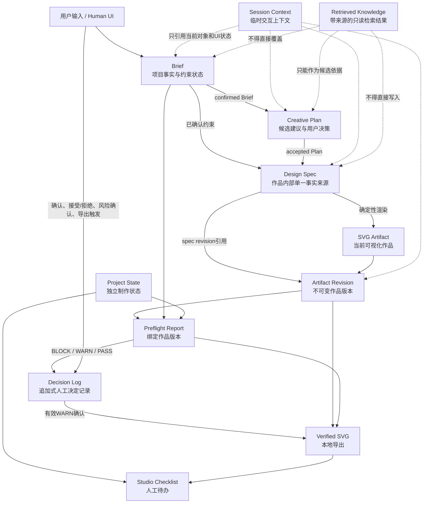

# MakerFlow Data Model v0.1

> Status: Draft  
> Scope: MakerFlow v0.1，单一场景为“MomoRay模块化枕头包装内高度调节说明卡”  
> Architecture choice: 版本化结构对象 + 当前版本指针 + 追加式Decision Log  
> Basis: 当前MVP Scope、Agent Task Graph、Node I/O Matrix、Skill Registry v1.1与低保真Demo数据结构

## 1. 目标与边界

本数据模型把项目事实、候选建议、作品规格、外部制作状态、作品版本、检查结果和会话上下文分开管理。目标是让每个对象只有一个稳定职责，并保证人工确认的事实不会被旧模型输出或检索内容覆盖。

本版是产品架构草案，不代表已经建立后端数据库、模型API、RAG、AImake集成或xTool Studio原生集成。当前Demo仍以浏览器`localStorage`保存组合状态。

核心不变量：

1. 当前`brief_revision`中由Human确认的字段是项目事实和约束的最高优先级来源；字段状态与Brief生命周期不得混用。
2. Creative Plan只保存候选建议及其接受/拒绝状态，不反写confirmed Brief。
3. `authoring_source = makerflow_spec`时Design Spec是创作事实来源；`authoring_source = external_artifact`时外部SVG Artifact是事实来源，Design Spec最多为`derived_partial`。
4. SVG是当前可视化作品和主要交付文件；PNG/JPG只作为素材或参考。
5. Project State独立保存设备、材料、加工参数、Preview和Framing状态，不从SVG推断。
6. Preflight Report必须绑定被检查的Artifact Revision；作品变化后旧报告失效。
7. BLOCK不能进入Export；WARN必须有当前Artifact Revision对应的Human Confirm。
8. Export后只显示Studio Checklist，不进入设备执行，也不保证加工成功。

## 2. 对象关系图



## 3. 九类数据对象

### 3.1 Brief

**职责**

- 保存用户目标、最终交付物、用途、目标用户、最终需要呈现的内容和已确认产品事实；
- 保存成品尺寸、材料方向、颜色方向、输出格式及视觉辅助需求；
- 为每个逻辑字段保留`confirmed`、`assumed`、`missing`、`needs_confirmation`等状态；
- 保存当前确认状态和必要的版本引用。

**不负责**

- 不保存设计元素坐标；
- 不保存Preflight结果；
- 不保存Studio功率、速度、次数或安全参数；
- 不因Creative Plan建议而自动修改confirmed事实。

**版本规则**

- Field-level status固定为`confirmed`、`assumed`、`missing`、`needs_confirmation`。
- Brief-level lifecycle固定为`draft`、`ready_for_confirmation`、`confirmed`、`superseded`。
- 用户确认产生一个`lifecycle = confirmed`的`brief_revision`；这不要求所有非关键字段均为`confirmed`。
- 用户修改confirmed事实时产生新版本，并使引用旧Brief版本的Creative Plan和Design Spec标记为stale；
- `brief_revision`格式、起始值与历史保留数量为`[待确认]`。

### 3.2 Creative Plan

**职责**

- 只针对`assumed`、`needs_confirmation`、`undecided`或允许建议辅助决策的`missing`字段生成候选；
- 保存`recommendation`、依据、优点、限制、置信度、补充要求和用户决定；
- 保存accepted Plan，作为T07 Build Design Spec的输入之一；
- 引用生成时使用的confirmed Brief版本。

**不负责**

- 不对confirmed字段重复推荐；
- 不把Recommendation写成产品事实；
- 不生成设备功率、速度、次数或安全参数；
- 不直接生成图片或SVG。

**版本规则**

- 单项“换一个建议”只更新该建议，其他accepted项保持不变；
- Brief版本变化后，旧Plan保留history但不得继续构建设计；
- Plan版本编号方式为`[待确认]`。

### 3.3 Design Spec

**职责**

- 将confirmed Brief与accepted Plan映射为可渲染、可验证的内部设计模型；
- 保存画板、布局、内容块、视觉元素、颜色和生产输出要求；
- 作为SVG Renderer的唯一结构化输入；
- 用户通过结构化控件或受控拖拽修改Design Spec，而不是直接编辑JSON。

**来源状态**

- `authoring_source`：`makerflow_spec`或`external_artifact`；
- `design_spec_status`：`native`、`derived_partial`或`none`；
- MakerFlow-native路径使用`native` Design Spec；外部SVG不得被宣称可100%恢复为完整Design Spec。

**不负责**

- 不保存用户访谈；
- 不保存原始产品事实；
- 不保存Studio功率、速度、次数或Preview状态；
- 不保存Preflight结果；
- 不保存Agent运行日志。

详细规范见`13_Design_Spec_Schema_v0.1.md`。

### 3.4 Project State

**职责**

- 保存设备、材料、processing parameters、Preview、Framing等独立项目状态；
- 作为T12 Studio Readiness Check的唯一事实输入；
- 记录状态是`pending`、已由用户提供还是已由用户确认。

**边界**

- 不从SVG或Design Spec推断材料、设备或加工参数；
- 具体材料和参数必须由用户确认；
- xTool Studio真实状态读取与原生同步均为`[待实际验证]`，当前不存在集成。

**版本规则**

- Project State变化后，引用旧状态版本的Studio Readiness结果失效；
- Project State版本字段及编号方式为`[待确认]`。

### 3.5 Artifact Revision

**职责**

- 表示某个Design Spec revision经过确定性渲染得到的不可变作品版本；
- 关联Design Spec revision、SVG内容或内容摘要、作品来源和生成方式；
- 作为Preflight Report、WARN确认和Export的版本锚点。

**最小关系字段**

- `artifact_revision`；
- `source_design_spec_revision`；MakerFlow-native产物必须记录，外部Artifact可为`null`；
- `artifact_type`，当前为`svg`；
- `svg_content`或持久化引用：具体方式`[待确认]`；
- `content_hash`：算法与格式`[待确认]`；
- `source_type`，例如MakerFlow模板生成或用户上传；
- `created_at`：格式`[待确认]`。

**规则**

- 用户编辑Design Spec、拖动元素、上传新SVG或修改素材后产生新Artifact Revision；
- 旧Artifact Revision保留history，不再作为当前导出对象；
- 当前Demo只生成SVG。PDF要求不得因当前实现不支持而被静默删除或改写。

### 3.6 Preflight Report

**职责**

- 保存T10 SVG File Check、T11 Brief Consistency Check、T12 Studio Readiness Check及T13 Route Issues的结果；
- 绑定Artifact Revision、confirmed Brief版本和Project State版本；
- 保存issues、三层状态、检查摘要以及BLOCK/WARN/PASS路由结果。

**规则**

- Design Spec、SVG内容、Artifact Revision或相关Project State变化后，旧报告标记stale；
- BLOCK不得直接Export；
- WARN确认必须绑定当前Artifact Revision；
- PASS只表示通过MakerFlow当前规则，不保证加工成功。
- 报告必须记录`checked_artifact_revision`；同时记录所依据的`brief_revision`与Project State版本。

### 3.7 Decision Log

**职责**

- 追加记录人工权限相关决定；
- 支持追溯“谁在什么版本上确认了什么”，但不替代各结构对象的当前状态。

**当前应覆盖的事件**

- Brief确认或退回修改；
- Creative Plan建议接受、拒绝或重新考虑；
- WARN风险接受或拒绝；
- 用户触发导出；
- Studio设置由用户确认的记录`[待实际验证]`。

**规则**

- Decision Log追加写，不通过覆盖旧记录来重写历史；
- 记录结构、actor标识、时间格式和保留期为`[待确认]`；
- 不保存模型隐藏推理或Agent chain-of-thought。

### 3.8 Session Context

**职责**

- 保存当前步骤、已解锁步骤、选中元素、zoom、pan、Undo快照、临时提示和未提交输入；
- 支持刷新恢复当前低保真流程；
- 只通过对象ID或当前版本指针引用业务状态。

**边界**

- Session Context不是项目事实来源；
- UI选中、展开或缩放状态不得进入Brief或Design Spec；
- 当前Demo把Session Context与项目对象共同保存在localStorage，逻辑上仍应分区。

### 3.9 Retrieved Knowledge

**职责**

- 保存一次检索任务中获得的带来源知识片段、适用范围和有效性信息；
- 仅在需要外部知识时作为Model候选依据。

**边界**

- 不自动写入confirmed Brief；
- 不直接写入Design Spec；
- 不作为Studio实时状态；
- 当前Demo没有RAG或外部知识检索，所有相关字段与存储实现均为future，具体结构`[待确认]`。

## 4. 当前版本指针与历史关系

建议项目容器只保存对象集合和当前指针，不把所有字段混成一个巨型对象：

```yaml
project:
  current_brief_revision: "[待确认]"
  current_creative_plan_version: "[待确认]"
  current_design_spec_revision: "[待确认]"
  current_artifact_revision: "[待确认]"
  current_project_state_version: "[待确认]"
  current_preflight_report: "[待确认]"

  briefs: []
  creative_plans: []
  design_specs: []
  project_states: []
  artifact_revisions: []
  preflight_reports: []
  decision_log: []

session_context: {}
retrieved_knowledge_cache: []
```

这是一种逻辑模型，不代表当前已经建立数据库或以上物理集合。具体存储介质和ID策略均为`[待确认]`。

## 5. 与Agent Node I/O的对应

| 数据变化 | 主要节点 | 规则 |
|---|---|---|
| 输入形成Brief候选 | T01 → T02 | T02当前为mock，不确认字段 |
| Brief校验与追问 | T03 → T04 → T01 | 缺失事实ASK，不由模型补写 |
| confirmed Brief | T05 | Human Gate |
| Creative Plan | T06 | 只针对未确定约束 |
| accepted Plan | Human/UI决定 | 建议接受/拒绝为CONFIRM |
| 初始Design Spec | T07 | 当前Demo为local_rule |
| SVG与Artifact Revision | T08 | 生成新`artifact_revision`并记录`source_design_spec_revision` |
| 新Design Spec/Artifact Revision | T09 → T08 | 编辑先增加`design_spec_revision`，渲染后增加独立`artifact_revision`，旧Preflight失效 |
| Preflight Report | T10–T13 | 绑定当前版本，Rule不被LLM改写 |
| WARN Decision | T15 | 必须人工确认 |
| Verified SVG | T16 | 本地导出，不发送Studio |
| Studio Checklist | T17 | 展示人工待办，不执行设备 |

## 6. 当前Demo映射与增量需求

当前Demo使用一个`makerflow-v2-state` localStorage对象保存：Brief、Creative Plan、Design、Preflight、WARN确认、Studio Readiness和UI状态。v0.1首先建立逻辑边界，不要求立即大规模重构。

后续最小增量：

1. 为Brief增加`brief_revision`与独立lifecycle；
2. 使用独立的`design_spec_revision`与`artifact_revision`；
3. 让Preflight绑定`checked_artifact_revision`，而不只比较整数`state.design.revision`；
4. 把WARN确认和关键人工决定写入轻量Decision Log；
5. 将Session Context与长期项目状态逻辑分区；
6. 为现有localStorage v2状态提供迁移入口，迁移策略`[待确认]`；
7. 继续从Project State读取Studio待办，不改变现有Preflight规则；
8. 为输出要求增加`requirement_level = required | preferred | optional`：required PDF缺失时允许SVG部分导出，但整体handoff为`blocked`或`incomplete`；preferred PDF缺失为WARN。

## 7. 不属于v0.1现状的Future能力

- 后端数据库、账户体系和跨设备同步；
- 多用户权限与企业级审计；
- 完整Event Sourcing；
- RAG知识库和外部模型API；
- 素材对象存储；
- PDF Verified Artifact；
- AImake或xTool Studio原生集成；
- `studio.handoff`；
- 设备控制或加工成功保证。
