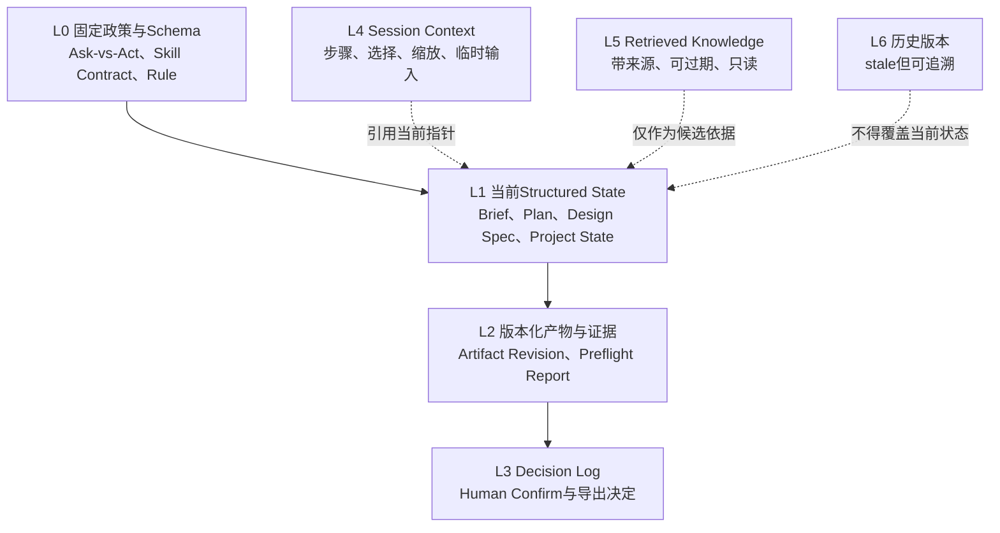

# MakerFlow Context & Memory Architecture v0.1

> Status: Draft  
> Scope: MakerFlow v0.1的数据上下文、短期会话状态与长期项目记录边界  
> Current reality: 当前Demo无模型API、无RAG、无后端数据库，使用浏览器localStorage保存组合状态

## 1. 架构原则

1. Structured State优先于自然语言摘要和模型历史输出。
2. 当前`brief_revision`中的Human confirmed字段优先于Recommendation、Retrieved Knowledge和模型推断；Brief lifecycle与字段状态分层保存。
3. 每次Model调用只检索完成当前节点所需的最小上下文。
4. Rule和Tool的硬规则不由LLM动态改写。
5. Session Context只服务当前交互，不成为项目事实。
6. Retrieved Knowledge必须带来源，只能形成候选或证据。
7. 旧版本保留history，但不得获得当前版本的执行权限。
8. 不保存模型隐藏推理、chain-of-thought或无关个人数据。

## 2. Memory层级



该层级同时表达两种概念：

- **权威性**：人工确认事实和确定性规则高于模型输出；
- **生命周期**：Session和Retrieved Knowledge比项目对象更短。

| 层                   | 存什么                                                | 什么时候取         | 什么时候忘                  |
| ------------------- | -------------------------------------------------- | ------------- | ---------------------- |
| Project State       | confirmed Brief revision、accepted Plan、Design Spec、当前对象指针 | 几乎每次相关调用      | 被新状态 supersede，不直接删除历史 |
| Session Context     | 最近几轮对话、当前页面、当前操作                                   | 当前任务需要时       | Session结束或TTL          |
| Decision Log        | 用户接受/拒绝了什么、为什么                                 | 解释历史决策、恢复上下文  | 长期保留，可版本化              |
| Knowledge Retrieval | 材料知识、xTool文档、案例                                | 用户问题需要外部知识时   | 原知识不“忘”，通过索引更新         |
| Artifact / Trace    | SVG版本、Preflight结果、Prompt版本、模型版本                    | Debug、Eval、审计 | 按保留策略归档                |

## 3. A. 什么信息STORE

### 3.1 项目级持久记录

- Brief当前`brief_revision`、lifecycle、字段状态及必要历史版本；
- Creative Plan建议、用户接受/拒绝、补充要求和Brief版本引用；
- Design Spec当前`design_spec_revision`及必要历史revision；
- Project State；
- Artifact Revision（含独立`artifact_revision`、`source_design_spec_revision`与authoring状态）；
- Preflight Report（含`checked_artifact_revision`）；
- Decision Log；
- Verified SVG导出摘要和未覆盖风险。

“持久”表示逻辑上需要跨步骤保留，不代表当前已经有服务端数据库。当前实现仍是localStorage。存储介质、保留期限和容量限制为`[待确认]`。

### 3.2 会话级临时记录

- 当前步骤和已解锁步骤；
- 当前选中元素；
- zoom、pan和面板展开状态；
- 至少一次Undo所需快照；
- 临时表单输入和提示；
- 上传过程中的临时预览状态。

当前Demo为了刷新恢复把其中一部分写入localStorage；逻辑上仍属于Session Context。

### 3.3 检索缓存

如果未来启用RAG，可短期保存：

- query或任务意图摘要；
- 来源引用；
- 检索片段；
- 来源版本或更新时间；
- 适用范围；
- 过期时间。

具体字段、TTL与缓存介质均为`[待确认]`。

## 4. B. 什么信息不STORE

- 模型隐藏推理、chain-of-thought和Agent内部思维过程；
- 无必要的完整Prompt副本；
- 与当前项目运行无关的用户访谈、研究原话和研究者解释；
- 未获授权的敏感个人信息；
- AImake或xTool Studio凭据；当前也不存在相关集成；
- 可由Design Spec确定性重建的临时SVG DOM缓存；
- 浏览器Object URL等不可持久引用；
- 过期检索排序、临时召回分数或无来源文本；
- 将Recommendation复制为confirmed事实的派生字段；
- Studio功率、速度、次数或安全参数的模型推断值。

是否保存完整SVG字符串还是保存文件引用，由未来存储实现决定，为`[待确认]`。

## 5. C. 每次Model调用如何RETRIEVE context

采用节点级最小Context Envelope：

```yaml
context_envelope:
  node_id: string
  policy_refs: []
  contract_ref: string
  current_object_refs: []
  confirmed_fact_snapshot: {}
  direct_input: {}
  relevant_decisions: []
  retrieved_knowledge: []
  stale_refs_excluded: []
```

字段名和传输实现为`[待确认]`；这里定义的是逻辑内容。

### T02 / `brief.extract`

读取：

- 当前`task_input`；
- 当前Brief candidate；
- confirmed字段保护列表；
- 初始或clarification输入模式。

不读取：

- 无关历史Plan；
- Preflight结果；
- Studio设置。

### T04 / `brief.ask_missing`

读取：

- `brief_candidate`；
- `brief_validation_result`；
- Ask-vs-Act政策；
- 已问过且仍有效的问题摘要。

不读取：

- 用于替用户决定的推荐答案；
- 过期Brief版本的问题。

### T06 / `plan.generate`

读取：

- 当前confirmed Brief；
- 仅未确定字段列表；
- Constraint Recommendations边界；
- 必要的单一场景约束；
- 必要时加入Retrieved Knowledge。

不读取或不使用：

- confirmed字段作为Recommendation目标；
- 旧accepted Plan来覆盖新Brief；
- 机器参数候选。

### T07 / `design_spec.build`

读取：

- 当前confirmed Brief；
- 与该Brief版本匹配的accepted Plan；
- Design Spec Schema；
- 当前可用layout template和资源映射规则。

当前Demo的T07为`local_rule`。未来即使加入Model做语义映射，Schema与硬约束仍由Rule控制，provider变化不得改变Skill I/O Contract。

### 非Model节点

T03、T08、T10、T11、T12、T13和T16直接读取Structured State或当前Artifact，不通过RAG获取硬规则，也不需要模型历史对话。

## 6. D. Context优先级

发生冲突时，从高到低采用：

1. 当前版本的Human confirmed Brief事实与有效Decision Log；
2. 当前有效的Schema、Ask-vs-Act政策、Skill Contract和确定性Rule；
3. 当前版本Structured State：Brief、accepted Plan、Design Spec和Project State；
4. 当前Artifact Revision及确定性Preflight证据；
5. 当前Session Context；
6. 有来源且未过期的Retrieved Knowledge；
7. 尚未接受的AI Recommendation；
8. stale历史对象和旧模型输出。

补充规则：

- 若confirmed事实彼此冲突，不通过优先级静默选值，必须ASK或BLOCK；
- Retrieved Knowledge与confirmed事实冲突时，只能展示差异并请求用户处理；
- Rule结果与模型建议冲突时，Rule决定是否可继续。

## 7. E. 什么信息会EXPIRE

| 信息 | 失效或过期条件 | 处理 |
|---|---|---|
| Session Context | 会话结束、用户重置或TTL到期 | 删除或重建；TTL`[待确认]` |
| 临时上传预览 | 上传取消、正式保存或页面关闭 | 删除临时引用 |
| Retrieved Knowledge | 来源更新、TTL到期或任务结束 | 不再进入Model context；TTL`[待确认]` |
| Creative Plan | 引用的confirmed Brief版本变化 | 标记stale，保留history |
| accepted Plan | 用户重新考虑或Brief版本变化 | 取消当前资格，保留决定记录 |
| Design Spec | 输入Brief/Plan版本不再当前 | 标记stale，不再渲染为当前作品 |
| Preflight Report | Artifact Revision变化 | 标记stale，必须复检 |
| WARN确认 | Artifact Revision变化 | 失效，必须针对新版本重新确认 |
| 导出资格 | BLOCK出现、WARN未确认或版本变化 | 立即撤销 |
| Studio Readiness结果 | Project State版本变化 | 重新运行T12/T13 |

## 8. F. 被新revision覆盖但保留history的信息

应保留：

- 已确认Brief的旧版本；
- Creative Plan建议及接受/拒绝记录；
- Design Spec旧revision；
- Artifact Revision；
- 对应的Preflight Report；
- WARN确认和导出触发记录；
- 外部SVG上传来源记录。

保留history不等于继续有效。所有执行门禁只读取当前版本指针及与其一致的决定。历史数量、归档策略和删除机制为`[待确认]`。

## 9. G. 什么情况下使用RAG

未来只有以下情况适合RAG：

- 从较大的、经过治理的知识库定位制作术语或规则说明；
- 从用户上传的长篇产品资料中寻找相关段落；
- 检索已有模板说明、经过验证的设备软件边界或知识来源；
- 需要返回来源、版本和适用范围的知识辅助。

使用RAG后的内容仍然是Retrieved Knowledge，不自动成为项目事实。用户上传资料中的候选事实必须经ASK/CONFIRM后才能进入confirmed Brief。

当前Demo没有RAG。本文件不虚构检索API、Embedding、Vector Database或任何模型供应商已经接入。

## 10. H. 什么情况下直接读取Structured State

以下情况必须直接读取Structured State：

- 判断Brief字段是否confirmed、assumed、missing或needs_confirmation；
- 获取A6对应的`148 × 105 mm`成品尺寸；
- 判断哪些字段可以进入Creative Plan；
- 获取accepted Plan并构建Design Spec；
- Renderer读取当前Design Spec；
- Preflight读取当前SVG、confirmed Brief、Design Spec和Project State；
- 判断Preflight是否对应当前Artifact Revision；
- 判断BLOCK、WARN和PASS；
- 判断WARN是否被当前版本人工确认；
- 判断是否允许本地导出；
- 展示Studio Checklist。

上述判断不得依赖RAG召回结果或模型聊天历史。

## 11. I. 如何避免旧AI建议覆盖Human confirmed事实

### 11.1 版本绑定

- 每个Creative Plan记录其输入Brief版本；
- accepted Plan必须与当前confirmed Brief版本一致；
- Design Spec记录输入Brief/Plan版本引用，具体字段名`[待确认]`；
- 模型完成后、写入前再次检查当前版本；版本不一致则输出标记stale。

### 11.2 写权限隔离

- `brief.extract`只能写Brief candidate，不能产生confirmed状态；
- `plan.generate`只能写Creative Plan；
- Recommendation不能直接写入confirmed Brief；
- `design_spec.build`只能创建Design Spec，不修改Brief迎合Plan；
- Retrieved Knowledge不能直接写Brief或Design Spec；
- confirmed字段只允许Human显式修改。

### 11.3 冲突处理

- 缺失产品事实：ASK；
- 候选事实确认：CONFIRM；
- Recommendation生成：ACT；接受/拒绝：CONFIRM；
- 新高影响决策：ASK；
- confirmed事实与Plan或Design Spec冲突：BLOCK；
- 模型推断Studio材料、设备或参数：BLOCK。

### 11.4 失效传播

```text
Human修改confirmed Brief
→ 新Brief version
→ 旧Creative Plan stale
→ 旧accepted Plan失去当前资格
→ 旧Design Spec关联失效
→ 当前Artifact/Preflight/Warning Decision不得继续用于Export
```

## 12. 当前Demo需要做什么

本轮不要求大规模改代码。后续建议按最小增量处理：

1. 在现有localStorage state内部先建立逻辑分区，不立即引入后端；
2. 引入当前对象指针和版本引用，字段格式`[待确认]`；
3. 将`state.design.revision`逐步拆分为Design Spec revision与Artifact Revision；
4. Preflight从“比较revision整数”升级为绑定Artifact Revision和内容摘要；
5. 将`routing.confirmedWarnings`升级为带Artifact Revision引用的Decision Log记录；
6. 将UI选择、zoom、pan、Undo等明确归入Session Context；
7. 保留Project State独立来源，不改变现有Studio Readiness规则；
8. 为现有localStorage v2数据定义显式migration，具体迁移版本与回退策略`[待确认]`。

## 13. Future能力

- 后端项目存储与跨设备同步；
- 多用户权限和确认人身份；
- 可治理的知识库与RAG；
- Retrieved Knowledge来源失效通知；
- 历史版本差异比较和恢复；
- 素材对象存储；
- 数据保留、导出和删除政策；
- PDF Verified Artifact；
- 经实际验证后评估的`studio.handoff`。

这些能力不表示已经接入DeepSeek、OpenAI、AImake或xTool Studio，也不改变当前“本地SVG导出后由用户完成Studio设置”的产品边界。
